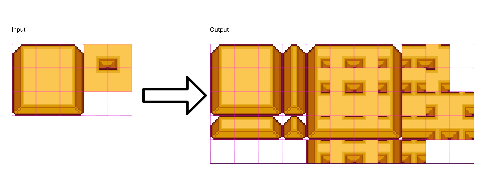

# Autotiler

Autotile tileset generator application with Godot export support.

Generates a full autotile tileset using a 15-tile image, including a
resource with configured collisions and bitmask ready to be used in Godot.

 
## Features

- Generates 42-tile Blob tilesets out of 15-tile Wang tilesets.
- Supports any tile size (multiples of 8)
- Godot Tileset resource export with configured region, bitmask, collisions and icon.

For roadmap and suggestions please [use this thread](https://github.com/itsjavi/autotiler/issues/1).

## Usage

### Basic instructions
Once you have the app installed and open, you only need to open a tileset with 13 tiles on the left side, arranged as shown in the screenshot (or as in the example images at the bottom).

The tile size is detected automatically, even though you can manually edit it in the input.

Be sure that your image is made of 5 tiles wide and 3 tiles tall, regardless of the single tile size.

After placing the image, the autotile tileset will be generated automatically and you can save the image using the save button.

### Exporting to Godot
To export the tileset to Godot, you need to save it preferably on your Godot project folder. This will create a folder with the PNG, a .tres and a .import file. Once exported, you can open Godot and it will recognize it automatically.

Once opened in Godot, you can move the assets to other folders, but the first time it needs to be in the Godot project folder root.

## License

This project is licensed under the [MIT license](LICENSE).
