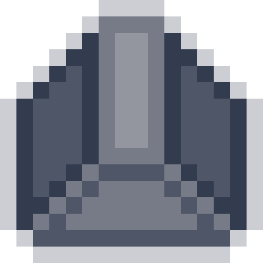
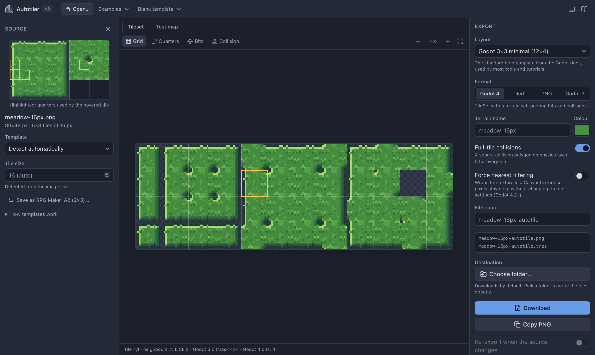
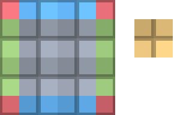
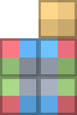

#  Autotiler

Turn a small terrain template into a complete autotile tileset: the 47-tile blob set or a 16-tile dual grid, ready
for **Godot 4**, **Tiled** or any engine. Free, open source, and it runs offline.



**Get it:** [desktop apps for macOS, Windows and Linux](https://github.com/itsjavi/autotiler/releases/latest) ·
[web version](https://itsjavi.com/autotiler/) (nothing to install) · [itch.io](https://route1rodent.itch.io/autotiler)

## Features

- **Two template formats in:** the Autotiler 13-tile template (5×3 tiles) and the RPG Maker A2 floor autotile
  (2×3, as in VX Ace, MV and MZ). The template kind and tile size are detected from the image. Any tile size from
  2 px works (the dual grid needs an even size).
- **Four layouts out:** Godot 3×3 minimal (12×4, the layout from the Godot docs), Autotiler v1 (11×5),
  GameMaker 47 (8×6) and a 16-tile dual grid (4×4, for the TileMapDual addon).
- **Exports:**
  - **Godot 4:** a TileSet `.tres` with a terrain set, the peering bits of all 47 tiles and full-tile collisions.
    The texture path is relative, so the files work in any folder of your project.
  - **Tiled:** a `.tsx` tileset with a Wang set, for the terrain brush.
  - **PNG:** optionally with a JSON map of each tile's neighbour mask, for custom engines.
  - **Godot 3 (legacy):** an autotile with the 3×3 minimal bitmask.
- **Preview:** grid, quarter, peering-bit and collision overlays. An inspector shows each tile's neighbours and
  bitmask (hover a tile, or focus the tileset and use the arrow keys).
- **Test map:** paint and erase with the tileset, or fill the map randomly or with every combination. Tiles are
  picked the way Godot's terrain painter picks them.
- **Workflow:** open, drag and drop or paste the template. Copy the result back to the clipboard. The app also has
  examples, blank colour-coded templates, and converts templates between 13-tile and RPG Maker A2.
- **Live updates:** in the desktop app (and in Chrome or Edge on the web) you can export straight into a folder.
  Autotiler watches the template and re-exports when you save it, so an edit in Aseprite shows up in Godot.
- **Tested:** golden-image tests keep the output pixel-exact. The Godot 4 export is checked by painting every
  terrain combination in headless Godot 4.7.

## Templates

Every output tile is assembled from four quarters. Each quarter shows one of five pieces, depending on its
neighbours. A template draws each piece at least once:

| Autotiler 13-tile (5×3)                                                                                                                     | RPG Maker A2 (2×3)                                                                                                                                    |
| ------------------------------------------------------------------------------------------------------------------------------------------- | ----------------------------------------------------------------------------------------------------------------------------------------------------- |
|                                                                  |                                                                                  |
| A 3×3 island (outer corners, edges and fill) plus a 2×2 block whose centre holds the inner corners. The two bottom-right cells aren't used. | The top-left tile is RPG Maker's palette thumbnail and isn't used. The top-right tile holds the inner corners, and the 2×2 block below is the island. |

Colours in the blank templates: 🟥 outer corner · 🟦 horizontal edge · 🟩 vertical edge · 🟨 inner corner ·
⬜ fill. Download them from the app's **Blank template** menu, paint over them and open the result. The app dims
the cells it doesn't read, and it warns about empty pieces.

The **examples** make good starting points too: a meadow, a pond, side-view grassy ground, cobblestone and lava,
at 16 px, with 24 and 32 px versions and an RPG Maker A2 meadow. They're rendered by
`scripts/make-examples.ts`, which draws every piece from its distance to the terrain edge, so all 47 tiles join
seamlessly.

## Using the tileset

### Godot 4

1. Pick **Godot 4** and export into your project. In the desktop app, choose the folder once: the app shows its
   `res://` path, and every later export is one click.
2. Select a TileMapLayer and load the `.tres` as its **Tile Set**.
3. In the **TileMap** panel, open **Terrains**, select the terrain and paint (Rect, Path or Connect mode).

For crisp pixel art, set _Project Settings → Rendering → Textures → Canvas Textures → Default Texture Filter_ to
**Nearest**. Or turn on **Force nearest filtering** before exporting (Godot 4.2+).

### Dual grid

Pick the **Dual grid** layout and export a PNG for [TileMapDual](https://github.com/pablogila/TileMapDual). Its
tiles use TileMapDual's standard 4×4 order. The same layout exports to Tiled as a corner Wang set.

### Tiled

Add the exported `.tsx` to your map (_Map → Add External Tileset…_), then paint with the **Terrain Brush** and
the tileset's terrain set.

### Other engines

Export the **PNG** with **JSON tile map** turned on. For every tile, the JSON lists its position and its 8-bit
neighbour mask: N = 1, NE = 2, E = 4, SE = 8, S = 16, SW = 32, W = 64, NW = 128. A corner only counts when both
sides next to it are set. For the dual grid it lists the filled corners instead (TL = 1, TR = 2, BL = 4, BR = 8).

### RPG Maker

Open a 13-tile template, choose **Save as RPG Maker A2**, and paste the 2×3 block into an A2 slot of your
tileset. It works the other way too, if you want to take A2 art to Godot.

### Godot 3

The **Godot 3** export writes the PNG, a `.png.import` with filtering off and an autotile `.tres` with the 3×3
minimal bitmask and collisions.

## Installing

- **macOS 13 or later** (one universal build for Apple Silicon and Intel). The app is ad-hoc signed but not
  notarized, so macOS blocks it the first time. Open it once, then go to _System Settings → Privacy & Security_ and
  click **Open Anyway**. On macOS 13 and 14 you can also right-click the app and choose **Open**.
- **Windows 10 and 11:** the `-setup.exe` or the `.msi`. Both need WebView2, which Windows 11 includes; the
  installer adds it on Windows 10 when it's missing.
- **Linux:** the `.AppImage`, `.deb` or `.rpm`, with WebKitGTK 4.1. If the window stays blank on an NVIDIA GPU,
  start the app with `WEBKIT_DISABLE_DMABUF_RENDERER=1`.
- **Web:** any current browser. Firefox and Safari download the files (several files come as a `.zip`), while
  Chrome and Edge can also write into a folder and reload the template when it changes.

## Development

You need Node.js 24 or later and pnpm (the version is pinned in `package.json`; `corepack enable` picks it up).
The desktop app also needs Rust and the [Tauri prerequisites](https://v2.tauri.app/start/prerequisites/) for
your OS.

```bash
pnpm install
pnpm dev            # web app on http://localhost:5173
pnpm desktop:dev    # desktop app with hot reload
pnpm check          # formatting, lint, type check and unit tests
pnpm test:e2e       # Playwright smoke tests in Chromium and WebKit
pnpm desktop:build  # native bundles in src-tauri/target/release/bundle
```

| Folder      | What's in it                                                                                                                                                                             |
| ----------- | ---------------------------------------------------------------------------------------------------------------------------------------------------------------------------------------- |
| `src/core`  | The tileset engine: templates, layouts, generation and exporters. Plain TypeScript with no DOM, React or Node APIs (lint-enforced), so it runs in the browser, the desktop app and Node. |
| `src/app`   | The React UI. `platform/` holds the web and desktop (Tauri) implementations of files, dialogs and settings.                                                                              |
| `src-tauri` | The desktop shell (Tauri 2).                                                                                                                                                             |
| `tests`     | Golden images, the headless Godot check and the Playwright tests.                                                                                                                        |
| `scripts`   | `make-examples.ts` (the example templates and their previews), `update-golden.ts` (after an intended output change, review the diff) and `screenshots.ts` (README images).               |

The Godot check runs as part of `pnpm test` when a Godot 4 binary is found (`GODOT_BIN`, `/Applications/Godot.app`
or `godot` on the `PATH`). Otherwise it's skipped.

**Releasing:** bump the version in `package.json` (and `src-tauri/Cargo.toml`), add it to `CHANGELOG.md`, then
push a `vX.Y.Z` tag. The release workflow builds every platform into a draft GitHub Release; publishing the draft
also pushes the builds to itch.io, once the `ITCH_GAME` variable and `BUTLER_API_KEY` secret are set. The web
version deploys from `main` to GitHub Pages.

## Feedback

Ideas and requests are welcome in the [roadmap thread](https://github.com/itsjavi/autotiler/issues/1) and in
[issues](https://github.com/itsjavi/autotiler/issues).

## License

[MIT](LICENSE)
